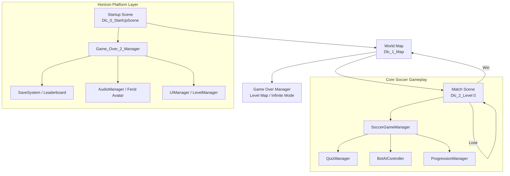

# WorldCup — Project Overview

> **Unity 2022.3.62f3** · Product name: **WorldCup**  
> Educational soccer game themed around the FIFA World Cup, built for the **Horizon Education** platform with Arabic (AR), English (EN), and French (FR) support.

---

## Table of Contents

1. [High-Level Architecture](#high-level-architecture)
2. [Scene Flow](#scene-flow)
3. [Core Game — World Cup Soccer](#core-game--world-cup-soccer)
4. [Game Over Manager 2.0 (Platform Framework)](#game-over-manager-20-platform-framework)
5. [Localization & RTL Support](#localization--rtl-support)
6. [Third-Party Libraries](#third-party-libraries)
7. [Project Folder Structure](#project-folder-structure)
8. [Key Scripts Reference](#key-scripts-reference)
9. [Data & Persistence](#data--persistence)
10. [Build Configuration](#build-configuration)

---

## High-Level Architecture

This repository is a **single Unity project** composed of several integrated modules:

| Module | Location | Purpose |
|--------|----------|---------|
| **World Cup Soccer Game** | `Assets/Scripts/` | Custom 2D soccer gameplay with quiz-based scoring |
| **Game Over Manager 2.0** | `Assets/Game_Over_Manager_2.0/` | Horizon platform shell: menus, XP, leaderboard, level map, audio, save system |
| **Ferid Localization Core** | `Assets/_FeridAroundTheWorld/` | Horizon-specific localization helpers and editor tools |
| **NoSuchStudio Localization** | `Assets/NoSuchStudio/` | CSV-based localization framework |
| **RTL / Arabic Text** | `Assets/RTLTMPro/`, `Assets/ArabicSupport/` | Right-to-left text rendering for Arabic UI |
| **UI & Animation** | LeanTween, TextMesh Pro, GUI PRO Kit | Visual polish and tweening |



---

## Scene Flow

### Build Settings (active scenes)

| Order | Scene | Description |
|-------|-------|-------------|
| 0 | `Dlc_0_StartUpScene[AR]` | Startup / initialization |
| 1 | `Dlc_1_Map[AR]` | World map — country selection |
| 2 | `Dlc_2_Level[AR] 0` | Soccer match gameplay |

Additional scenes exist under `Assets/Game_Over_Manager_2.0/Over_Manger_2_Scenes/` for the platform framework (level nodes, infinite mode, lab scene, etc.).

### Player Journey

1. **Startup** — Game Over Manager initializes user data, language, and audio.
2. **World Map** — Player selects an unlocked country/region opponent.
3. **Match** — 2D soccer match against a country-specific bot (first to 5 goals wins).
4. **Quiz Gate** — Every goal triggers a World Cup trivia question that determines whether the score counts.
5. **Match End** — Win unlocks the next country; player can restart, play again, or return to map.

---

## Core Game — World Cup Soccer

Location: `Assets/Scripts/`

### Gameplay Summary

A **2D physics-based soccer mini-game** where the player controls a character via on-screen buttons (move left/right, jump, shoot). The opponent is an AI bot whose stats vary per country. Matches are won by reaching **5 goals** (`WIN_SCORE` in `SoccerGameManager`).

### Scoring & Quiz System

Scoring is **not automatic on goal** — it is gated by educational quiz answers:

| Event | Correct Answer | Wrong Answer |
|-------|----------------|--------------|
| **Player scores** | Player +1 point | No point awarded |
| **Bot scores** | Bot blocked (no point) | Bot +1 point |
| **Power-up bubble collected** | Player earns Super Shoot | Game resumes, no reward |

Quiz questions cover World Cup facts (2026 hosts, team counts, 2022 winner, etc.) and are managed by `QuizManager` with a non-repeating shuffle pool.

### Power-Up System

- **`PowerUpSpawner`** — Spawns floating bubbles 2–4 times per match at random intervals (15–55 s).
- **`PowerUpBubble`** — Travels across the field; collected by player or bot via proximity detection.
- **Player collection** → triggers a quiz; correct answer grants **Super Shoot**.
- **Bot collection** → bot gains super shoot directly.
- **Super Shoot** — Enhanced kick with ball trail, scale punch animation, and increased force (`BallController.ActivateSuperMode()`).

### Bot AI

`BotAIController` (v2.0) implements a full state machine:

| State | Behavior |
|-------|----------|
| `Idle` | Standby |
| `Chase` | Intercept ball using time-of-arrival prediction |
| `Shoot` | Approach and kick toward goal |
| `Defend` | Protect own goal when ball is nearby |
| `GoalieBlock` | Track predicted ball position as goalkeeper |
| `ReturnGoal` | Return to home position |
| `CollectBubble` | Chase power-up bubbles |
| `Reposition` | Step back after shooting to avoid crowding |

Difficulty is configurable per country via `BotStatsData` ScriptableObjects (speed, kick force, difficulty 0–1, jersey color).

### World Progression

`ProgressionManager` manages unlock order across **5 regions** and **10 countries**:

| Region | Countries (index) |
|--------|-------------------|
| Africa | Algeria (0), Germany (7) |
| America | Argentina (1), Brazil (3), USA (9) |
| Oceania | Australia (2) |
| Europe | France (4), Russia (5) |
| Asia | Japan (6), Niger (8) |

- Algeria starts unlocked.
- Beating a country unlocks the next in its region.
- Completing a region unlocks the first country of the next region.
- Progress saved via `PlayerPrefs` (`unlocked_*`, `completed_*` keys).

### Country Selection & Match Setup

| Script | Role |
|--------|------|
| `CountryFlagButtonHandler` | Map UI — flag buttons, lock overlays, play button |
| `CountryDataHolder` | Singleton holding selected country and bot prefab registry |
| `CountryBotLinker` | Registers country → bot prefab mappings |
| `BotStatsLinker` | Applies country-specific stats to spawned bot |
| `BackgroundManager` | Loads country-themed pitch background from `Resources/` |

### Bot Prefabs & Stats

Located in `Assets/Prefabs/Bots/`:

- **10 bot prefabs**: Algeria, Argentina, Australia, Brazil, France, Germany, Japan, Niger, Russia, USA
- **10 BotStats ScriptableObjects**: Per-country AI tuning (`BotStats_*.asset`)
- **Player prefab**: `Assets/Prefabs/Player.prefab`

### Match End UI

`MatchEndPopup` shows win/lose message with three actions:
- **Restart** — Reload current match scene
- **Next Match** — Load next opponent scene
- **Return to Map** — Back to `Dlc_1_Map[AR]`

---

## Game Over Manager 2.0 (Platform Framework)

Location: `Assets/Game_Over_Manager_2.0/`

Horizon Education's reusable game shell that wraps individual mini-games. Provides shared infrastructure for user accounts, progression, audio, UI animations, and backend integration.

### Core Components

| Script | Responsibility |
|--------|----------------|
| `Game_Over_2_Manager` | Singleton — language, XP/level calculation, user data |
| `Game_Over_2_UIManager` | Map UI, level selection, infinite mode, settings, scoreboard |
| `Game_Over_2_LevelManager` | Dynamic level node spawning on scrollable map |
| `Game_Over_2_GameInteraction` | In-game win/lose panels, stars, timer, pause |
| `Game_Over_2_AudioManager` | SFX, music, Ferid voice lines |
| `Game_Over_2_SaveSystem` | PlayerPrefs persistence for stars, XP, user profile |
| `Game_Over_2_DataBase_Manager` | Leaderboard fetch (backend calls currently commented out) |
| `Game_Over_2_LoadScene` | Scene loading with transitions |
| `Game_Over_2_Ferid` / `Game_Over_2_Ferid_Talks` | Mascot avatar and contextual speech |

### XP & Leveling

- **Level mode**: XP = stars earned × per-level XP factor
- **Infinite mode**: XP = score / 2 (capped at level 10)
- Level thresholds use exponential curve: `100 × 2^(level-1)`
- Level-up panel triggered on XP milestones

### Game Modes (Framework)

| Mode | Scene Pattern | Description |
|------|---------------|-------------|
| **Main Menu** | `Dlc_0_MainMenu[Lang]` | Entry point |
| **Map** | `Dlc_1_Map[Lang]` | Level selection scroll map |
| **Level** | `Dlc_2_Level[Lang] N` | Individual level gameplay |
| **Infinite Mode** | `Dlc_3_Infinte_Mode[Lang]` | Endless challenge (unlocked after all levels) |
| **Level Up** | `Dlc_4_LevelUp[Lang]` | XP celebration screen |

Language suffix `[AR]`, `[EN]`, or `[FR]` is appended dynamically via `Game_Over_2_Constants.Set_Language()`.

### Data Models (`horizon.Models`)

| Model | Fields |
|-------|--------|
| `LeaderboardModel` | GameID, ParentId, KidIndex, KidName, BestScore, Xp, Stars, avatar accessories |
| `AccountsModel` | User account data |
| `DLCModel` | Downloadable content metadata |
| `B2BModel` | Business-to-business integration |
| `RouletteRewardModel` | Reward wheel prizes |
| `FeedbackModel` | User feedback |
| `AppVersionModel` | Version checking |

### Ferid Mascot

- Animated character (`Game_Over_2_Ferid`) with clothing/accessory sprite sheets
- Voice lines for tutorials, win/lose, idle hints, infinite mode unlock
- Avatar customization (upper/lower body accessories stored in user profile)

### Prefabs & Assets

- `Game_Over_Manager_Prefab/` — Canvas prefabs for in-game UI (EN/AR variants)
- `GUI PRO Kit - Simple Casual/` — UI component library (buttons, frames, panels)
- `Casual Music Pack/` — Background music and jingles
- `Game_Over_2_SFX/` — Sound effects and Ferid speech audio
- `Over_Manger_2_Animations/` — Map intro/outro, panel open/close animations

---

## Localization & RTL Support

### NoSuchStudio Localization (`Assets/NoSuchStudio/Localization/`)

- CSV file-based translation sources
- Runtime localizers for TextMeshPro, UI sliders, audio clips
- Editor tools for managing locale keys

### Ferid Localization Core (`Assets/_FeridAroundTheWorld/Localization/`)

- `LocalizationHelper` — Phrase keys, RTL detection, localized item wrappers
- `LocalizationRuntimeSingleton` — Runtime language state
- `WebglCurrentLanguageInitilizer` — WebGL language bootstrap
- Editor tools: `AutomatedLocalizationTool`, `AiLocalization`, `LocalizationToolWindow`

### RTL Text Rendering

| Package | Purpose |
|---------|---------|
| **RTLTMPro** | RTL-aware TextMesh Pro component with Arabic glyph shaping |
| **ArabicSupport** | `RtlText` component for legacy UI Text |
| **UPersian** | Persian/Arabic input components (used in Game Over Manager UI) |

Supported languages: **Arabic (AR)**, **English (EN)**, **French (FR)**.

---

## Third-Party Libraries

| Library | Location | Usage |
|---------|----------|-------|
| **LeanTween** | `Assets/LeanTween/` | UI and object tweening/animation |
| **TextMesh Pro** | `Assets/TextMesh Pro/` | Advanced text rendering (scores, quiz, UI labels) |
| **RTLTMPro** | `Assets/RTLTMPro/` | RTL text for Arabic UI |
| **NoSuchStudio** | `Assets/NoSuchStudio/` | Localization, variables, networking, data storage |
| **GUI PRO Kit** | Inside Game Over Manager | Pre-built casual UI prefabs |
| **Newtonsoft JSON** | Unity Package | JSON serialization for backend models |

---

## Project Folder Structure

```
Trainee_horizon_Education_WorldCupGame/
├── Assets/
│   ├── Scripts/                    # ★ Core World Cup soccer game logic (22 scripts)
│   ├── Scenes/                     # Main game scenes (Startup, Map, Level)
│   ├── Prefabs/
│   │   ├── Player.prefab
│   │   └── Bots/                   # 10 country bot prefabs + BotStats assets
│   ├── Resources/
│   │   ├── CountryBackgroundData.asset
│   │   └── Backgrounds/            # Per-country pitch backgrounds (10 PNGs)
│   ├── Materials/                  # Physics materials (ball)
│   ├── images/                     # UI sprites
│   │
│   ├── Game_Over_Manager_2.0/      # ★ Horizon platform framework
│   │   ├── Over_Manger_2_Scripts/  #   Manager, UI, Save, DB, Level Map scripts
│   │   ├── Over_Manger_2_Scenes/   #   Framework scenes (levels, map, infinite)
│   │   ├── Game_Over_Manager_Prefab/
│   │   ├── Over_Manger_2_Animations/
│   │   ├── Game_Over_2_SFX/
│   │   ├── Ferid/                  #   Mascot sprites & animations
│   │   ├── Avatar/                 #   Player avatar customization
│   │   └── GUI PRO Kit - Simple Casual/
│   │
│   ├── _FeridAroundTheWorld/       # ★ Horizon localization tools
│   ├── NoSuchStudio/               # Localization & utility framework
│   ├── RTLTMPro/                   # RTL TextMesh Pro
│   ├── ArabicSupport/              # Arabic RTL text components
│   ├── LeanTween/                  # Animation tweening
│   └── TextMesh Pro/               # Text rendering
│
├── Packages/manifest.json          # Unity package dependencies
├── ProjectSettings/                # Unity project configuration
└── UserSettings/                   # Editor layout preferences
```

---

## Key Scripts Reference

### Core Game (`Assets/Scripts/`)

| Script | Description |
|--------|-------------|
| `SoccerGameManager` | Match orchestrator — scoring, quiz flow, freeze/unfreeze, win condition |
| `QuizManager` | Quiz panel UI — question pool, answer selection, result callback |
| `BotAIController` | Full AI state machine — chase, shoot, defend, goalie, bubble collection |
| `PlayerUIController` | Touch controls — move, jump, shoot, super shoot with pulse animation |
| `BallController` | Ball physics — reset, super mode, trail effects, last-touch tracking |
| `GoalDetector` | Goal collision detection — triggers quiz on score |
| `PowerUpSpawner` | Timed bubble spawning (2–4 per match) |
| `PowerUpBubble` | Floating power-up — movement, collection, quiz trigger |
| `ProgressionManager` | Region/country unlock progression via PlayerPrefs |
| `CountryFlagButtonHandler` | World map UI — country selection, lock states, scene loading |
| `CountryDataHolder` | Singleton — selected country, bot prefab registry |
| `CountryBotLinker` | Maps country names to bot prefabs |
| `BotStatsLinker` | Applies country-specific AI stats at match start |
| `BotStatsData` | ScriptableObject — per-country bot tuning |
| `BackgroundManager` | Loads country-themed backgrounds |
| `MatchEndPopup` | Win/lose popup with restart/map navigation |
| `RegionData` | Region definition (name + country index list) |
| `CountryFlag` | Serializable country data (name + flag sprite) |
| `PlayerGoalZone` | Gizmo-only defensive zone marker for bot AI |
| `UIRoundedCorners` | UI visual utility |
| `GameDataHolder` | Static selected country string holder |

### Game Over Manager (`Assets/Game_Over_Manager_2.0/Over_Manger_2_Scripts/`)

| Script | Description |
|--------|-------------|
| `Game_Over_2_Manager` | Platform singleton — language, XP, level math |
| `Game_Over_2_UIManager` | Map/level/infinite mode navigation |
| `Game_Over_2_LevelManager` | Scrollable level node map generation |
| `Game_Over_2_GameInteraction` | In-game panels — win, lose, stars, timer, pause |
| `Game_Over_2_SaveSystem` | Stars, XP, user profile persistence |
| `Game_Over_2_DataBase_Manager` | Leaderboard data (async fetch) |
| `Game_Over_2_AudioManager` | SFX and music management |
| `Game_Over_2_Ferid` | Mascot character controller |
| `Game_Over_2_Ferid_Talks` | Contextual voice line triggers |
| `Game_Over_2_LoadScene` | Scene transition loader |
| `Game_Over_2_AlertPanel` | Alert/notification panel |
| `Game_Over_2_LeaderBoardEntry` | Leaderboard row UI element |
| `Game_Over_2_ScoreboardElement` | Scoreboard display element |
| `Game_Over_2_Webgl_UI_Initilizer` | WebGL-specific UI setup |
| `Game_Over_2_Constants` | Scene names, animation keys, PlayerPrefs keys, SFX names |

---

## Data & Persistence

### PlayerPrefs Keys (Core Game)

| Key Pattern | Purpose |
|-------------|---------|
| `OpponentIndex` | Selected country index for current match |
| `OpponentCountry` | Selected country name string |
| `SelectedCountry` | Country chosen on map |
| `unlocked_{index}` | Whether country at index is unlocked |
| `completed_{index}` | Whether country at index is beaten |

### PlayerPrefs Keys (Game Over Manager)

Managed dynamically via `Game_Over_2_Constants.SET_KEYS()` based on user GameID:

| Key | Purpose |
|-----|---------|
| `{GameID}_userId` | Parent account ID |
| `{GameID}_{ParentId}_{KidIndex}_stars` | Total stars earned |
| `{GameID}_{ParentId}_{KidIndex}_xp` | Experience points |
| `{GameID}_{ParentId}_{KidIndex}_bestScore` | Infinite mode best score |
| `{GameID}_{ParentId}_{KidIndex}_name` | Player display name |
| `Sfx_State` / `Music_State` | Audio mute preferences |

---

## Build Configuration

| Setting | Value |
|---------|-------|
| Unity Version | 2022.3.62f3 LTS |
| Product Name | WorldCup |
| Render Pipeline | Built-in (2D) |
| Target Platforms | WebGL (primary), with Android/iOS module support |
| Default Web Resolution | 960 × 600 |
| Default Standalone Resolution | 1920 × 1080 |
| Color Space | Linear |
| Primary Feature Package | `com.unity.feature.2d` |

### Backend Integration Status

Several backend calls in the Game Over Manager are **commented out** (e.g., `Connect.Instance.UpdatePlayerScore`, `Connect.Instance.GetPlayerRank`). The save/load infrastructure and data models are in place, but live server communication appears disabled for local/trainee development.

---

## Quick Start for Developers

1. Open the project in **Unity 2022.3.62f3** or compatible LTS version.
2. Open scene `Assets/Scenes/Dlc_1_Map[AR]` to test country selection, or `Assets/Scenes/Dlc_2_Level[AR] 0` to jump directly into a match.
3. Press **Play** — Algeria is unlocked by default; select a country and click Play.
4. Use on-screen buttons to move, jump, and shoot. Answer quiz questions after each goal.
5. To reset progression: call `ProgressionManager.Instance.ResetProgress()` at runtime or clear PlayerPrefs.

---

*Generated from codebase analysis — July 2026*
